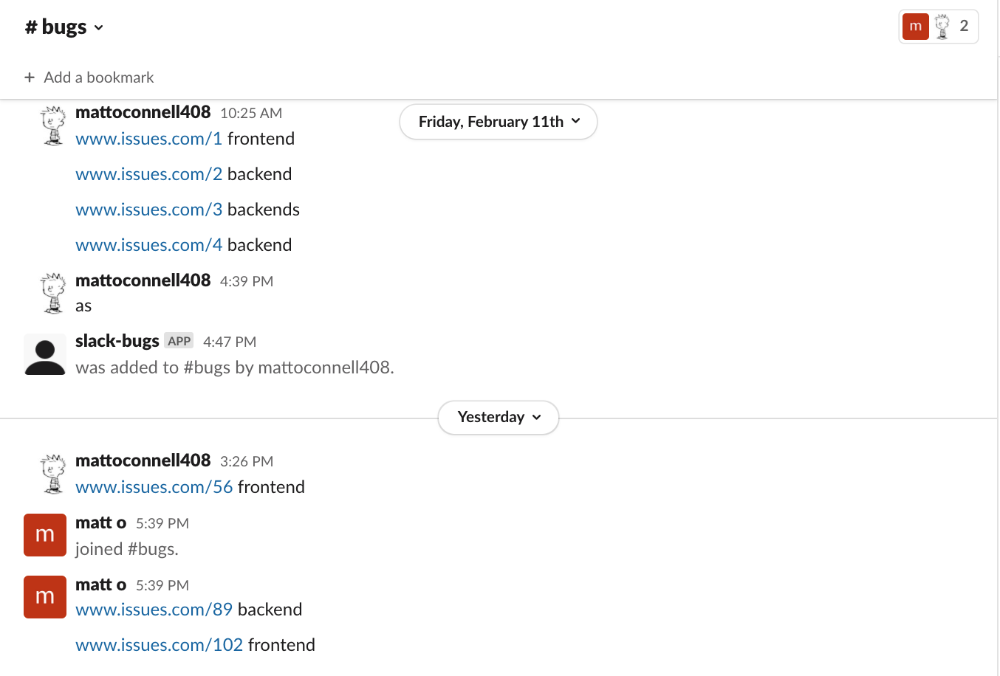

# slack-message-parser (slparse)

This tool is set up for quick retrieval of Slack messages using the Slack API. It implements some simple functions to parse the messages and customize your output. Check out some examples below!

# `Getting Started`

Install the command as a global NPM command:

```
npm install -g slparse
```

In order to use the tool, you'll need to obtain a SLACK_BOT_TOKEN and SLACK_SIGNING_SECRET for the Slack workspace that this tool will be integrated in.

You can store these tokens locally using:

```
$ slparse config set --SLACK_BOT_TOKEN="ABC123_MyBotToken" --SLACK_SIGNING_SECRET="ABC123_MySigningSecret"
```

You can delete them if you'd like using:

```
$ slparse config delete
```

Once you've set your tokens, you can install the app in your slack workspace. See [Basic app setup](https://api.slack.com/authentication/basics).

_It's possible to limit requests to subsets of IP addresses. In this case, I've limited it to those within the VPN network I'm signed into. Outside IPs will not be allowed to make requests_

After your app has been installed and your tokens have been stored, you are ready to start querying against your workspace.

# `Commands`

## `messages`

Right now, the CLI tool is configured to read and parse Slack messages from specified channels.

It applies "formatters" to the messages. In this case, formatters take in an array of `Messages` and output the data in a customized way. See the `core/formatters` directory to see some code examples.

Using the `getStackPercentage` formatter, we can output the percentage of "backend" vs "frontend" issue links from the past two days in the "bugs" channel:



```
slparse messages -c="bugs" -f="getStackPercentage" --daysAgo="2"
```

Will output:


Or if you want to output JSON that groups the messages according to "backend" vs "frontend" between two dates, run:

```
slparse messages -c="bugs" -f="groupByStack" --startTime="1644631325" --endTime="1644804126"
```

You could take that output and pipe it into an new file.

## `messages --help`

To see all configuration options for this command, run:

```
slparse messages --help
```

# `Notes`

Why choose the `oclif` CLI framework?

- Can use it to easily package a CLI for different OSes
- Very few runtime dependencies
- Has the testing structure configured already
- Has multiple configuration options and helpful formatting options

Why use the bolt-js framework?

- It's recommended by Slack as their go-to for developing slack JS apps

Authentication - We could do better:

- Slack allows for OAuth 2 so that admin users of a workspace could sign in with Slack creds to make the API requests
  - the issue is that we need a local https server to accept Slack's redirect which becomes difficult to spin up locally quickly
- Right now, it's only allowing IP addresses within our VPN IP blocks (configurable on a per-app basis)
- Could use internal OKTA verification to obtain bot token from Vault. But for now, I will not set up OKTA since it requires approval
